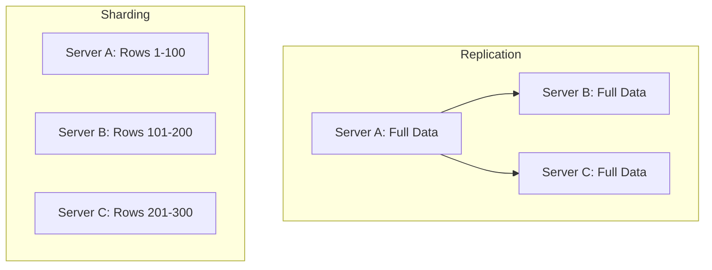

# Sharding & Replication

In distributed systems, scaling and reliability are achieved through two primary techniques: **Replication** and **Sharding**. While they are often used together, they solve different problems.

---

## 1. Replication (High Availability & Read Scaling)
Replication involves keeping a copy of the same data on multiple machines connected via a network.

### Why Replicate?
- **High Availability**: Keeping the system running even if one machine fails.
- **Latency Reduction**: Placing data geographically closer to users.
- **Read Scalability**: Increasing the number of simultaneous read requests the system can handle.

### Replication Models
#### A. Leader-Based (Master-Slave)
One node is designated as the **Leader** (Master), and others are **Followers** (Slaves/Replicas).
- **Process**: All writes go to the Leader. The Leader sends data changes to Followers.
- **Reads**: Can be served by any node (scales reads).
- **Failover**: If the Leader fails, one Follower is promoted to Leader.
- **Trade-off**: Synchronous replication ensures consistency but adds latency; Asynchronous is faster but risks data loss during failover.

#### B. Multi-Leader (Master-Master)
Multiple nodes can accept writes.
- **Use Case**: Multi-datacenter setups where each DC has its own leader.
- **Challenge**: Conflict resolution (e.g., two users updating the same record in different DCs simultaneously).

#### C. Leaderless (Quorum-Based)
Every node can accept reads and writes (e.g., Cassandra, DynamoDB).
- **Quorum**: A write is successful only if `W` nodes acknowledge it. A read is successful if `R` nodes respond.
- **Formula**: As long as `W + R > N` (where `N` is total nodes), you are guaranteed to read the latest value.

---

## 2. Sharding (Horizontal Scaling)
Sharding is the process of breaking up a large dataset into smaller chunks (**Shards**) and storing them across different machines.

### The Scaling Problem
- **Vertical Scaling**: Adding more CPU/RAM to one server (expensive, has physical limits).
- **Horizontal Scaling (Sharding)**: Adding more servers (virtually infinite scale).

### Types of Partitioning
- **Horizontal Partitioning (Sharding)**: Rows are split across servers. (e.g., Users 1-100 on Server A, 101-200 on Server B).
- **Vertical Partitioning**: Columns are split across servers. (e.g., User Login info on Server A, User Profile info on Server B).

---

## 3. Sharding Strategies
Choosing a "Shard Key" is the most critical decision in database architecture.

| Strategy | Description | Pros | Cons |
| :--- | :--- | :--- | :--- |
| **Range Based** | Shards based on ranges of values (e.g., A-M, N-Z). | Simple; efficient range queries. | Can lead to **Hot Spots** (e.g., all new users in the 'Z' shard). |
| **Hash Based** | Applying a hash function to the key to determine shard. | Even distribution of data; avoids hot spots. | Range queries are very slow (data is scattered). |
| **Directory Based** | A lookup service/table tracks which key is on which shard. | Highly flexible; easy to move data. | Lookup service can become a bottleneck/SPOF. |

### Consistent Hashing
Modern systems (like Amazon Dynamo) use **Consistent Hashing** to minimize data movement when nodes are added or removed. Instead of `hash(key) % N`, keys and nodes are mapped onto a "Hash Ring."

---

## 4. Challenges of Sharded Systems
Sharding is not a "free lunch"; it introduces significant architectural complexity:

1. **Cross-Shard Joins**: Joining tables that live on different shards is extremely slow or unsupported.
2. **Distributed Transactions**: Maintaining ACID properties across shards requires protocols like **Two-Phase Commit (2PC)** or **Saga Patterns**, which add latency.
3. **Resharding**: When a shard becomes too large or a node fails, rebalancing the data across new shards is a complex, high-IO operation.
4. **Data Skew**: If the shard key is poorly chosen, one shard might handle 90% of the traffic (Hot Shard).

---

## Summary: Replication vs. Sharding

- **Replication**: Same data on multiple nodes. Improves **Availability**.
- **Sharding**: Different data on multiple nodes. Improves **Scalability**.
- **Combined**: Production systems usually shard data and then replicate each shard for both scale and safety.
