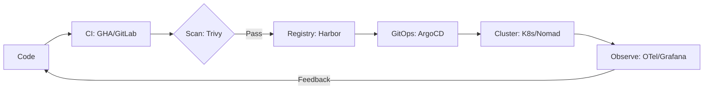

# DevOps Strategy — Tooling & Stack Selection

Choosing the right DevOps stack depends on your organization's maturity, cloud strategy, and developer experience (DX) goals.

---

## 1. Choosing Your Infrastructure Strategy

### Strategy A: The "Cloud Native" Stack (GCP/AWS/Azure)
Best for startups and modern tech companies who want high speed and low maintenance.
- **CI/CD**: GitHub Actions or GitLab CI.
- **Compute**: Kubernetes (GKE/EKS) or Serverless (Cloud Run/Lambda).
- **IaC**: Pulumi or Terraform.
- **Observability**: Datadog or OpenTelemetry + Honeycomb.

### Strategy B: The "GitOps" Stack (Advanced)
Best for teams running high-scale Kubernetes who want absolute state consistency.
- **CI**: GitHub Actions.
- **CD**: ArgoCD or FluxCD.
- **Orchestration**: Kubernetes with Helm/Kustomize.
- **Security**: Policy as Code (Kyverno) + Harbor Registry.

### Strategy C: The "Enterprise/Self-Hosted" Stack
Best for banks, government, or companies with strict data residency requirements.
- **CI/CD**: Jenkins or GitLab Self-Managed.
- **Compute**: Private Cloud (OpenStack) or Bare Metal with Nomad/K8s.
- **Artifacts**: JFrog Artifactory or Harbor.
- **IaC**: Terraform + Ansible for configuration.

---

## 2. Decision Matrix: Orchestration

| Feature | Kubernetes | HashiCorp Nomad | Docker Compose |
| :--- | :--- | :--- | :--- |
| **Complexity** | High | Medium | Very Low |
| **Effort to Manage** | High | Low-Medium | Very Low |
| **Workloads** | Containers Only | Anything (Binaries, VMs) | Containers Only |
| **Market Share** | ~80% (Standard) | ~10% (Growing) | Local Dev Standard |
| **Best For** | Massive scale, ecosystem | Simple clusters, non-Docker | Single server, local dev |

---

## 3. Decision Matrix: Infrastructure as Code

| Feature | Terraform | Pulumi | Ansible |
| :--- | :--- | :--- | :--- |
| **Primary Goal** | Provisioning | Provisioning | Configuration |
| **Language** | HCL (Static) | TS/Py/Go (General) | YAML (Static) |
| **Best For** | Platform teams | Full-stack developers | Sysadmins / Server config |

---

## 4. The "Gold Standard" Production Workflow (2024+)

1. **Commit**: Code is pushed to Git.
2. **Verify**: CI runs tests and security scans (SonarQube/Trivy).
3. **Package**: Build Docker image and push to a private registry (Harbor).
4. **Synchronize**: GitOps controller (ArgoCD) detects change in Git and updates the cluster.
5. **Observability**: Metrics and traces are sent to Grafana via OpenTelemetry.
6. **Cost Control**: Infracost monitors cloud spend on every PR.
